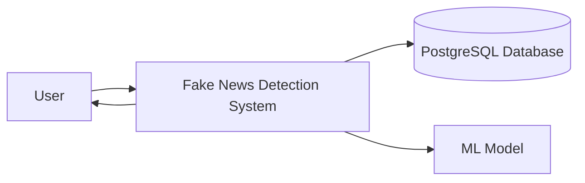
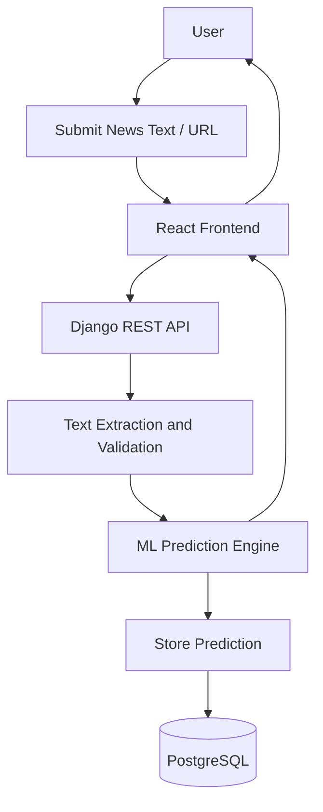
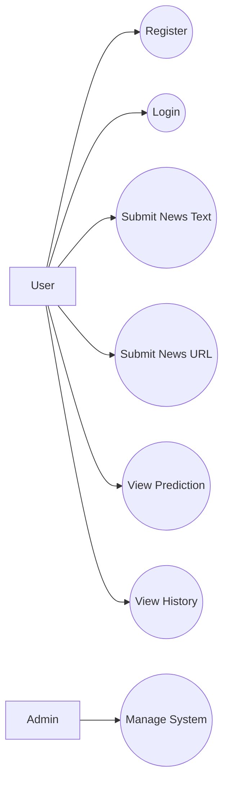
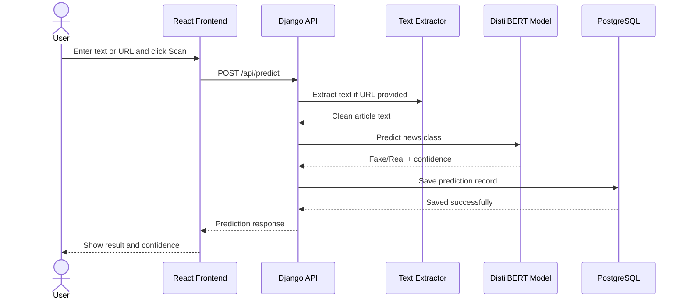
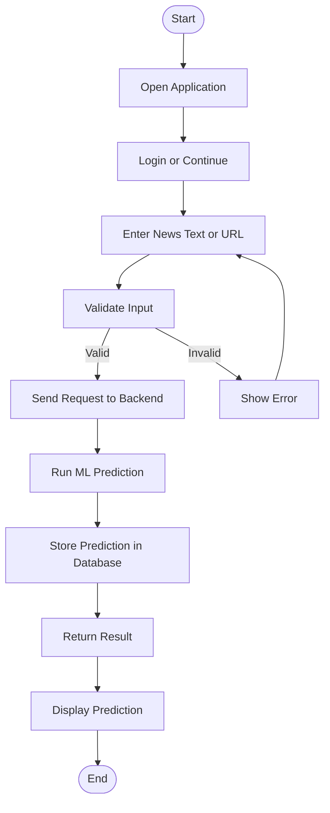
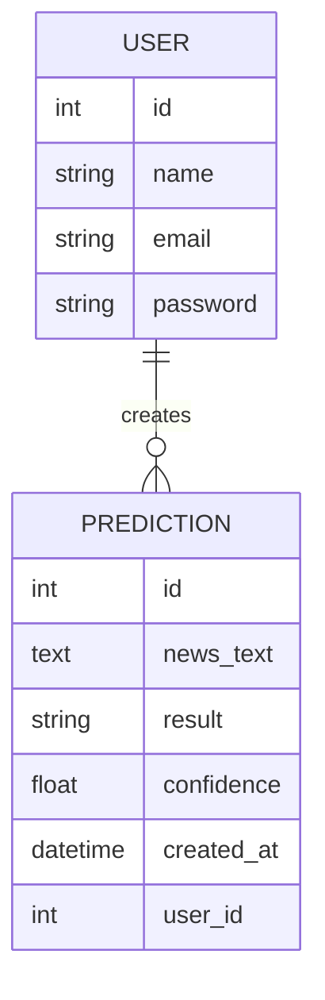
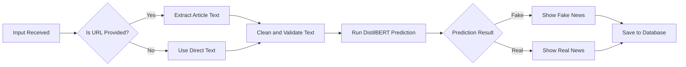
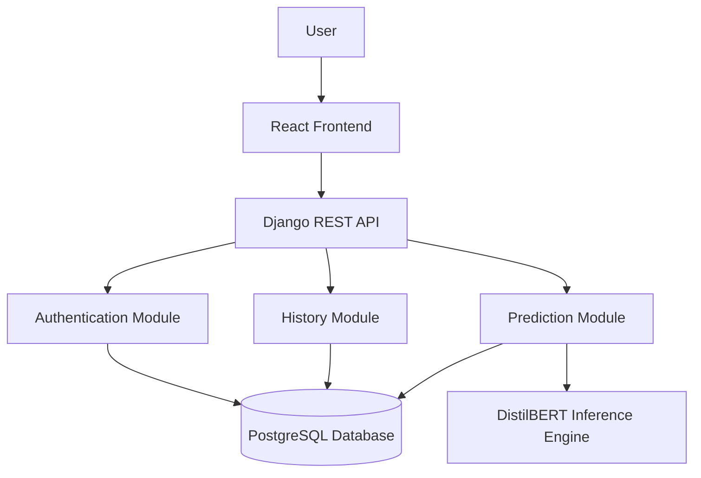

# Fake News Detector Project Report

## 1. Project Overview

**Project Title:** Fake News Detector  
**Project Type:** AI-based Web Application  
**Purpose:** To detect whether a news article is real or fake by using a trained NLP model and presenting results through a user-friendly web interface.

This project is currently built with a Django backend and a machine learning inference layer based on DistilBERT. For future enhancement, the frontend is planned in **React** and the database is planned in **PostgreSQL** to make the system more scalable, modern, and production-ready.

## 2. Proposed Technology Stack

| Layer | Technology |
|---|---|
| Frontend | React |
| Backend | Django + Django REST Framework |
| AI/ML Model | DistilBERT |
| Database | PostgreSQL |
| API Style | REST API |
| Authentication | Django Authentication |

## 3. Main Modules

1. **User Interface**
   Accepts news text or article URL from the user.

2. **Authentication Module**
   Handles user registration, login, logout, and session checking.

3. **Prediction Module**
   Sends input text to the backend and returns fake/real prediction with confidence.

4. **History Module**
   Stores and displays previous prediction records.

5. **Database Module**
   Stores users and prediction data in PostgreSQL.

6. **ML Inference Module**
   Loads the trained DistilBERT model and performs news classification.

## 4. Current and Planned Architecture

- **Current system:** Django templates + Django APIs + local ML model + SQLite
- **Planned system:** React frontend + Django REST API backend + DistilBERT model + PostgreSQL

The planned architecture improves separation of concerns, frontend flexibility, and database scalability.

## 5. Data Flow Diagram (DFD)

### Level 0 DFD

### Level 1 DFD

## 6. UML Use Case Diagram

## 7. Sequence Diagram (Scan Request Flow)

## 8. Activity Diagram

## 9. ER Diagram

## 10. Flow Control Diagram

## 11. System Diagram

## 12. Conclusion

The Fake News Detector project is a useful AI-based application for identifying misleading news content. The backend already supports prediction, authentication, and history features. By integrating **React** for the frontend and **PostgreSQL** for the database, the project can become more interactive, scalable, and better suited for real-world deployment. The proposed diagrams represent the overall structure, data movement, and system behavior in a simple and effective way.
